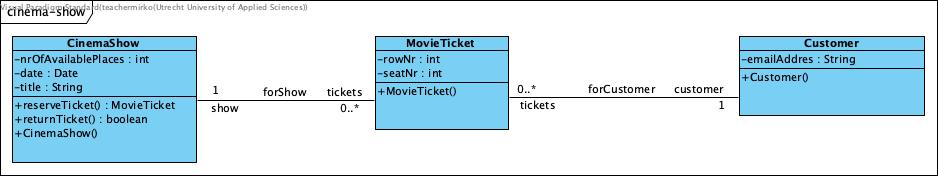

# CinemaShow
Dit is een voorbeeldproject voor Semester 2 van de opleiding Software Development aan de Hogeschool Utrecht. In dit 
voorbeeld worden de basis beginselen van Object Oriented Programming gedemonstreerd aan de hand van de verkoop van 
bioscoopkaartjes.

Om het voorbeeld zo simpel mogelijk te maken is er geen UI en draait de applicatie maar een keer. Ook wordt de data 
niet opgeslagen in een database.

> **NOTE**: Dit is de `class-basics` branch van het project waarin de eenvoudigste uitwerking staat. Het is NIET de 
> bedoeling deze branch te mergen naar de main branch! Meer complexe uitwerkingen die zaken als inheritance en 
> polymorphism gebruiken zijn in andere branches uitgewerkt.

# Werking
De applicatie bestaat uit 3 domeinklassen en de main klasse. 

## MovieTicket Klasse
Ten eerste is er het kaartje zelf. Omdat we code doorgaans in het Engels schrijven geven we deze Klasse de naam 
`MovieTicket`. Attributen zijn; `rowNr`, `seatNr`.

De klasse kent twee methoden; `MovieTicket()` en `toString()`. De eerste methode heeft de naam van de klasse, zo'n 
methode noemen we de constructor. De constructor is de methode die aangeroepen wordt als er via het `new` statement 
een nieuw object van de klasse gemaakt wordt. Een klasse kan (in java) meerdere constructors hebben (dat geld niet 
voor alle OOP talen), de vereiste is wel dat ze verschillende typen parameters hebben.

De constructor is een goede plaats om attributen te initialiseren. Bij movieTicket worden de parameters gekopieerd 
naar de attributen.

De tweede methode, `toString()` maakt een string (tekst) van de inhoud van de attributen. Dit kan heel nuttig zijn 
om tijdens het ontwikkelen te kijken wat de attributen zijn.

## CinemaShow Klasse
Het kaartje is bedoeld voor een voorstelling, in het Engels CinemaShow. Deze klasse heeft de volgende attributen; 
```
Collection<MovieTicket> tickets;
private final String title;
private int nrOfAvailablePlaces;
private LocalDate movieDate;
```

Wat hier opvalt is de `Collection<MovieTicket> tickets;`. Dit is de verzameling kaartjes die voor deze voorstelling 
al uitgegeven is. Dit is dus niet simpel een parameter die aan de constructor doorgeven wordt. Als we naar de 
constructor kijken dan zien we daar de volgende regel staan:

````
// Initialize the tickets list
this.tickets = new ArrayList<>();
````

Hier wordt de Colection geinitialiseerd als een ArrayList. Voor enkelvoudige attributen als een String of een int 
is het niet nodig om deze te initialiseren, maar voor collections wel. Na initialisatie is er een lege collectie 
(er is ook nog geen kaartje verkocht).

Naast de constructor heeft deze klasse de methode `reserveTicket()`. Deze methode wordt aangeroepen als er een 
kaartje verkocht moet worden. Als je de methode bekijkt dan zie je dat er eerst gekeken wordt of er nog kaartjes 
beschikbaar zijn, als dat zo is wordt er een nieuw `MovieTicket` object gemaakt en wordt dit object direct in de 
collection gezet en wordt de `nrOfAvailablePlaces` met 1 verlaagd.

## Customer Klasse
De klant die het kaartje wil kopen. Deze zou als attributen kunnen hebben; emailAddress (om de bevestiging heen te 
sturen), movieTickets (een verzameling gekochte tickets)

Net als de CinemaShow heeft ook de Customer klasse een Collection. In dit geval van alle kaartjes die de klant van 
allerlij verschillende voorstellingen gekocht heeft.

## Class diagram
De klassen en de onderlinge relaties zijn uitgewerkt in onderstaand UML klasse diagram.



## main klasse
De klasse main is het startpunt van de applicatie. Hierin worden de volgende acties gedaan om de code in de klassen 
te testen:
1. Er wordt een klant (Customer) aangemaakt `new Customer("name@domain.com");`. Dit is de klant die het kaartje 
   gaat kopen.
2. Vervolgens wordt er een voorstelling aangemaakt `new CinemaShow("Dune", movieDay, 200);`. Het gaat hier om de 
   film DUNE.
3. Vervolgens wordt er een kaartje van deze voorstelling aan de klant verkocht.

### Initialisatie
Voordat we stap 3 bekijken is er eerst de vraag waarom we stap 1 & 2 eigenlijk moeten doen. Voor de we actie 
(verkoop kaartje) kunnen uitvoeren moeten we het een en ander initialiseren. Omdat we geen UI en geen database 
hebben moeten we ergens een klant en een Voorstelling vandaag halen. We initialiseren hiermee de objecten die nodig 
zijn om de actie uit te voeren.

### Kaartverkoop
We vragen aan het object (NIET de klasse) cinemaShow om een kaartje te reserveren voor de klant. Dit doen we door 
de methode `reserveTicket()` van het object cinemaShow aan te roepen met als parameter de klant. Als we nu gaan 
kijken naar de code van deze methode dan zien we dat er gecontroleerd wordt of er nog kaartjes over zijn. Als er 
nog kaartjes zijn wordt er een nieuw `MovieTicket` object aangemaakt en teruggegeven, zo niet dan wordt er `null` 
teruggegeven.

In de main functie moeten we dus controleren of er null of iets anders teruggegeven wordt. Als er **geen** `null` 
teruggegeven wordt kunnen we het kaartje aan de klant koppelen. Dat doen we door de methode `addTicket()` aan te 
roepen van het object customer.

Als laatste wordt het object customer in de terminal afgedrukt
```
// Reserve tickets
MovieTicket movieTicket = cinemaShow.reserveTicket(customer);
if (movieTicket != null) {
    customer.addTicket(movieTicket);
}

System.out.println(customer.toString());
```

### toString() en terminal
In een echte applicatie wordt output natuurlijk naar een scherm gestuurd. Als developers hebben we vaak de behoefte 
om data te kunnen inzien terwijl het programma uitgevoerd wordt. Een van de manieren is de terminal.

Je kan tekst naar de terminal sturen met de methode `System.out.println()`. Als we alle attributen van het object 
`customer` willen afdrukken, dan moeten we van die attributen een String (tekst) maken, want dat is het enige dat 
println() af kan drukken. Dat doen we met de methode `toString()`. Als je in de code van de klasse Customer kijkt 
dan zie je dat deze methode daar uitgewerkt wordt. Het is aan te raden om van elke klasse een werkbare toString() 
methode te maken zodat je de objecten van de klasse in de terminal af kan drukken.

```
System.out.println(customer.toString());
```