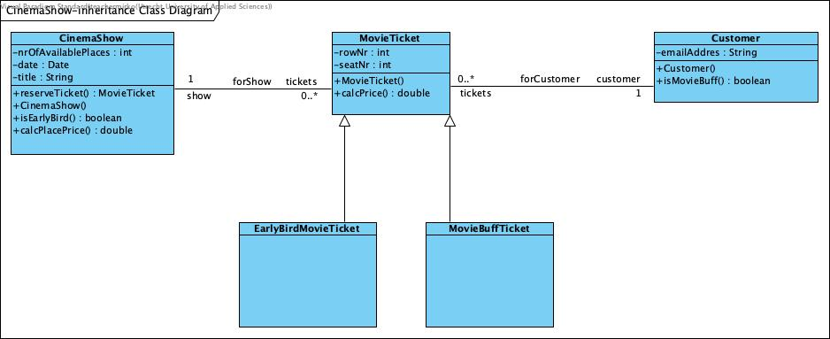

# CinemaShow
Dit is een voorbeeldproject voor Semester 2 van de opleiding Software Development aan de Hogeschool Utrecht. In dit
voorbeeld worden de basis beginselen van Object Oriented Programming gedemonstreerd aan de hand van de verkoop van
bioscoopkaartjes.

Om het voorbeeld zo simpel mogelijk te maken is er geen UI en draait de applicatie maar een keer. Ook wordt de data
niet opgeslagen in een database.

> **NOTE**: Dit is de `inheritance` branch van het project waarin een uitwerking staat die gebruik maakt van 
> overerving. Het is NIET de bedoeling deze branch te mergen naar de main branch! 

# Werking
In de `class-basics` branche hebben we gebruik gemaakt van de bioscoop waar we een kaartje wilde kopen voor een 
voorstelling. Stel dat we in dit voorbeeld ook de prijs van het kaartje willen weten en drie verschillende soorten 
kaartjes willen introduceren; **standaard kaartje**, **Early-bird kaartje** (met een korting van 10% als je 7 dagen 
voor de aanvang een kaartje koopt) en een **Movie-buff kaartje** (met een korting van 5% als je meer dan 25 kaartjes hebt gekocht).

We zeggen dan dat het Early-bird kaarje en het Movie-buff kaartje een 'soort van' kaartje zijn. Ze hebben alle
eigenschappen van een normaal kaartje en daarnaast nog een extra eigenschap.

## Klasse diagram
Hoe ziet dit er uit in een klasse diagram?

De **pijlen met een open pijlpunt** geven aan dat EarlyBirdMovieTicket & MovieBuffTicket subklassen zijn van de 
superklasse MovieTicket. Dit is UML syntax die je moet kennen! De superklasse MovieTicket heeft een extra functie gekregen calcPrice().

Voor meer details zie de HU SD kennisbank van semester 2.
